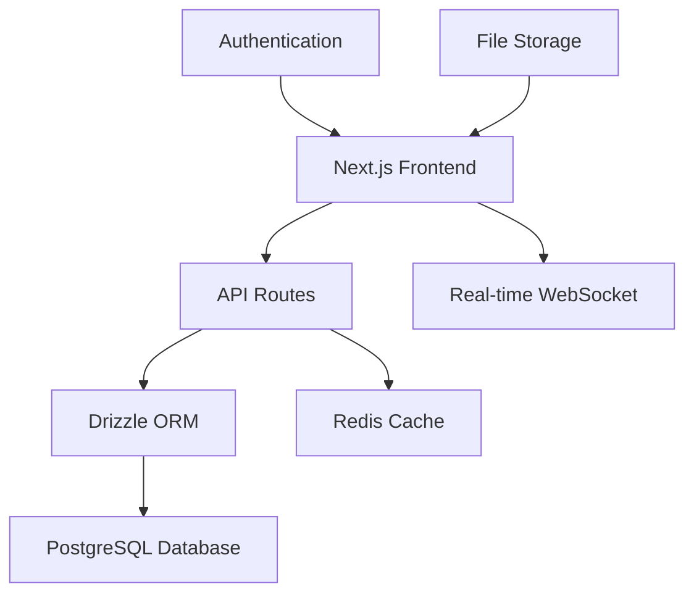

# LearnHub - E-Learning Platform

Welcome to LearnHub, a comprehensive e-learning platform built with Next.js 14, TypeScript, Drizzle ORM, and modern development practices. This documentation will guide you through setting up, developing, and deploying the platform.

## 🚀 Project Overview

LearnHub is designed as a collaborative training project for 7 interns, where each intern develops a specific module while working together on a unified platform. The project uses the latest technologies including Node.js 22 LTS and Drizzle ORM for optimal performance and developer experience.

### Key Features

- **Modular Architecture**: Each intern owns a specific module (Course Management, Student Management, etc.)
- **Modern Tech Stack**: Next.js 14, TypeScript, Drizzle ORM, PostgreSQL, Docker
- **Production Ready**: Complete CI/CD pipeline, testing, and deployment strategies
- **Real-time Features**: WebSocket integration for live updates and notifications
- **Comprehensive Documentation**: Detailed guides for every aspect of development

## 🏗️ Architecture



### Module Structure

Each module follows the same structure:
- **API Routes**: RESTful endpoints for CRUD operations
- **Database Models**: Drizzle schema definitions with full TypeScript support
- **UI Components**: React components for user interfaces
- **Business Logic**: Service layer for complex operations
- **Tests**: Unit, integration, and E2E tests

## 👥 Module Assignment

| Module | Intern | Responsibilities |
|--------|--------|------------------|
| Course Management | Intern #1 | Course creation, curriculum design, content organization |
| Student Management | Intern #2 | Student profiles, progress tracking, enrollment |
| Instructor Management | Intern #3 | Instructor tools, course authoring, analytics |
| Assessment System | Intern #4 | Quizzes, exams, grading, anti-cheating |
| Communication System | Intern #5 | Forums, messaging, notifications, Q&A |
| Payment & Enrollment | Intern #6 | Billing, subscriptions, enrollment workflow |
| Analytics & Reporting | Intern #7 | Platform metrics, insights, custom reports |

## 🛠️ Technology Stack

### Frontend
- **Framework**: Next.js 14 with App Router
- **Language**: TypeScript
- **Styling**: Tailwind CSS + Shadcn/ui
- **State Management**: Zustand + React Query
- **Forms**: React Hook Form + Zod validation

### Backend
- **Runtime**: Node.js 22 LTS
- **API**: Next.js Route Handlers
- **Database**: PostgreSQL with Drizzle ORM
- **Authentication**: NextAuth.js
- **File Storage**: UploadThing
- **Real-time**: Socket.io

### DevOps
- **Containerization**: Docker + Docker Compose
- **CI/CD**: GitHub Actions
- **Deployment**: Vercel + Railway
- **Monitoring**: Sentry + Vercel Analytics
- **Documentation**: MkDocs

## 📚 Quick Start

1. **Clone the repository**
```bash
git clone https://github.com/rcdelacruz/learnhub-intern-project.git
cd learnhub-intern-project
```

2. **Install dependencies**
```bash
npm install
```

3. **Set up environment**
```bash
cp .env.example .env.local
# Edit .env.local with your values
```

4. **Start development environment**
```bash
# With Docker (recommended)
docker-compose up -d

# Or manually
npm run dev
```

5. **Initialize database**
```bash
npm run db:generate
npm run db:push
npm run db:seed  # Optional: add sample data
```

The application will be available at `http://localhost:3000`.

## 📖 Documentation Structure

This documentation is organized into several sections:

- **[Getting Started](/getting-started/installation/)**: Setup and installation guides
- **[Git Workflow](/git-workflow/branching-strategy/)**: Development workflow and collaboration
- **[Module Development](/module-development/structure/)**: Guidelines for building modules
- **[Database](/database/schema/)**: Drizzle ORM schema and queries
- **[Modules](/modules/course-management/)**: Detailed documentation for each module
- **[API Reference](/api/authentication/)**: Complete API documentation
- **[Deployment](/deployment/docker/)**: Production deployment guides
- **[Contributing](/contributing/code-style/)**: Contribution guidelines

## 🤝 Development Workflow

1. **Pick a Task**: Choose from your assigned module's tasks
2. **Create Branch**: `git checkout -b feature/your-feature-name`
3. **Develop**: Write code following our guidelines
4. **Test**: Run tests and ensure coverage
5. **Document**: Update relevant documentation
6. **Submit PR**: Create pull request for review
7. **Deploy**: Merge triggers automatic deployment

## 🎯 Learning Objectives

By the end of this project, interns will have learned:

- Modern React and Next.js development
- TypeScript for type-safe development
- Database design and Drizzle ORM
- API design and implementation
- Authentication and authorization
- Real-time features with WebSockets
- Testing strategies and implementation
- Docker containerization
- CI/CD pipeline setup
- Production deployment
- Code collaboration with Git
- Technical documentation

## 🔗 Useful Links

- [GitHub Repository](https://github.com/rcdelacruz/learnhub-intern-project)
- [Live Demo](https://learnhub-intern-project.vercel.app)
- [API Documentation](https://learnhub-intern-project.vercel.app/api-docs)
- [Drizzle ORM Documentation](https://orm.drizzle.team/)
- [Next.js 14 Documentation](https://nextjs.org/docs)

## 🆘 Getting Help

- **Documentation**: Check this documentation first
- **GitHub Issues**: Create issues for bugs or questions
- **GitHub Discussions**: Ask questions and share ideas
- **Team Chat**: Use our Discord/Slack channel
- **Code Reviews**: Learn from peer feedback

## 🚀 New in This Version

### Node.js 22 LTS
- Latest stable features and performance improvements
- Better memory management and security
- Long-term support until 2027

### Drizzle ORM
- Full TypeScript type safety
- Better performance than Prisma
- SQL-like query syntax
- Smaller bundle size
- Superior debugging capabilities

### Development Experience
- **Drizzle Studio**: Visual database browser
- **Better IntelliSense**: Full type safety end-to-end
- **Faster Builds**: Optimized development workflow
- **Modern Tooling**: Latest development practices

---

Ready to start building? Head over to the [Installation Guide](/getting-started/installation/) to get your development environment set up!